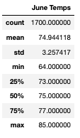
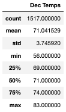
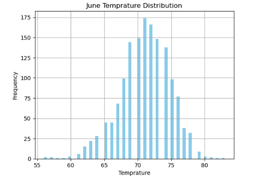
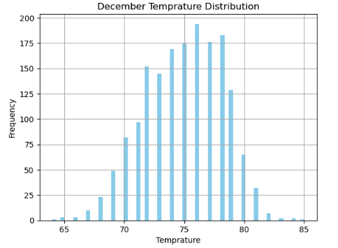
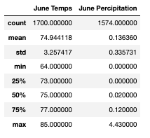
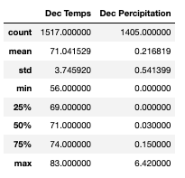
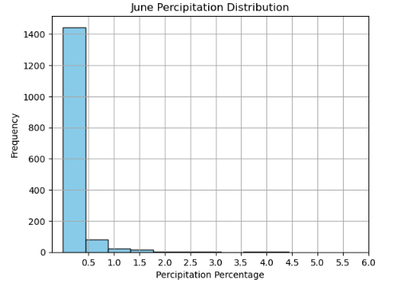
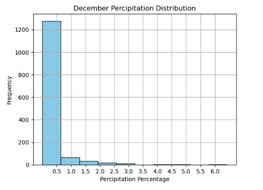

# Surf_Up

## Overview

This project is undertaken to help an investor to analyse the weather data of an island names Awahoo.This data analysis is the major key to make the bussiness plan sucessful.We have the dataset iof various aspects of weather like percipitation,temprature,humidity etc to analyse and provide the input whether the investment is worth or not.

## Software used:

- Jupyter Notebook
- SQLite Database
- SQLAlchemy
- Flask

 
## Analysis Results:

- The maximum temprature can reach upto 85°F in June and in December it was maximum recorded at 83°F.This shows that the temprature stays pretty much same all year around.

- If we look at the mean of temprature of both months,it is very similar.Average of June temprature is 74.9°F and December is 71.04°F.

- Standard deviation of temprature of both months supports our statement above regarding the same temprature stays same all year around.Standard deviation of June temprature is 3.26 and December is 3.75.

 

Also take a look at the temrature distribution of tempratures of both months.

 

### Summary: 

Based on our analysis results,temprature is pretty much same.We can suggest our client to go ahead and start the Shake n' Surf shop.We also dive deep into other aspects and analysed the percipitation levels of June and December.

- Average percentage of rainfall in December is 21.6% and June is 13.6% which shows December gets more average of rainfall than June.

- Maximum rainfall in December is 6.42 and June is 4.43 which is about 50% more than June.

 

Take a visual look at the percipitation level distribution for both months.

 

